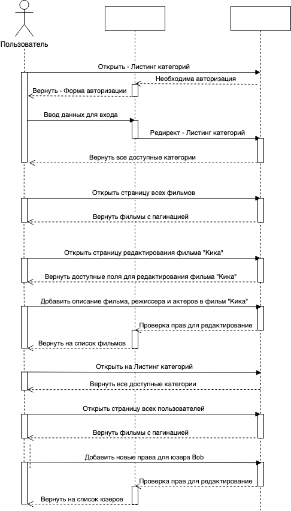

# Техническое задание

В качестве первого задания предлагается выполнить проект «Панель администратора». Этот сервис позволит менеджерам контента вести работу по добавлению новых фильмов и сериалов. Будет переработана схема SQLite и обновлён процесс обновления данных в ElasticSearch.

## Используемые технологии

- Код приложения пишется на **Python + Django,**
- Приложение запускается под управлением сервера WSGI,
- База данных — **postgresql,**
- Для отдачи [статических файлов](https://nginx.org/ru/docs/beginners_guide.html#static) используется **nginx,**
- Динамическое обновление данных в **ElasticSearch**.

## Основные сущности

- Пользователь — электронная почта, логин, пароль, дата регистрации, система прав.

- Фильм – заголовок, содержание, дата создания, возрастной ценз, режиссеры, актеры, сценаристы, жанры, ссылка на файл.
- Сериал - заголовок, содержание, даты создания, режиссеры, актеры, сценаристы, жанры, ссылка на файл.

- Актер — Имя, фамилия, его фильмы
- Режиссер — Имя, фамилия, его фильмы
- Сценарист — Имя, фамилия, его фильмы
- Жанр — Описание

## Основные страницы и формы

1. **Листинг категорий,** главная с группировкой по темам.
2. **Листинг фильмов** с пагинацией по 20 фильмов на странице. Необходимо реализовать сортировку по дате добавления и заголовоку фильма(2 вида сортировки). В шапке сайта находятся: 
    - логотип,
    - поисковая строка (для быстрого поиска по заголовку и содержимому
    фильма),
    - кнопка "задать фильм" (доступна только пользователем с правами на добавление).
3. **Страница добавления/редактирование фильма,** доступна только для пользователем с правами на добавление. 

    В форму вводится заголовок, описание и загружается фильм. Выбор жанров, актеров, сценаристов, режиссеров происходит через автодополнение. При обработке формы обязательна проверка валидности данных. 

    - Если фильм успешно добавлен —> пользователя перебрасывает на страницу редактирования фильма.
    - Если возникли ошибки —> их нужно отобразить в форме. На странице должна быть история изменений.
4. **Страница добавления сериала,** доступна только для пользователем с правами на добавление. 
    - В сериал вводится заголовок, описание и остальные атрибуты. Группирует фильмы в блок. При обработке формы обязательна проверка валидности всех данных.
    - Если фильм успешно добавлен —> пользователя перебрасывает на страницу фильма. Если возникли ошибки —> их нужно отобразить в форме. На странице должна быть история изменений.
5. **Страница истории изменений,** доступна только для пользователем с правами на добавление. 

    Показывает какой пользователь, в какое время и какую операцию выполнил над объектом.  

6. **Форма добавления/редактирование пользователя.** Состоит из исходных полей Django User. В форме можно выбрать, какие права есть у нового пользователя. 
7. **Форма авторизации**. Состоит из полей "логин" и "пароль". 
    - При успешной авторизации пользователь перебрасывается на исходную страницу (если пользователь переходит на страницу добавления фильма, но у него нет авторизации, необходим переход на окно логина и страницу добавления фильма).
    - При неуспешной авторизации в форме выводятся сообщения об ошибках формы.
8. **Форма разлогина**. Кнопка в шапке интерфейса. После выполнения перенаправляет на форму авторизации.

## Права пользователя

**Права**:

1. read_movie
2. edit_movie
3. create_movie
4. delete_movie
5. view_movies_list
6. read_user
7. edit_user
8. create_user
9. delete_user
10. view_users_list

**Группа**:

1. movies_admin, у которой права (1)-(5)  
2. movies_view, у которой права (1), (5)
3. security_officer, у которой права (6)-(10)

## Диаграмма последовательности для пользователя

## Обновление данных

Этот сервис позволяет обнаруживать изменения в базе данных и загружать данные в поисковый сервис. Ваше приложение должно уметь восстанавливать контекст и начинать читать с того места, где оно закончило свою работу.

## Требования к проекту

1. Структура проекта должна быть понятна пользователям. Переходы по
страницам осуществляются по ссылкам. Обработка форм должна
осуществляться с редиректом.
2. Код проекта должен быть аккуратным и без дублирования. Наличие
больших повторяющихся фрагментов кода или шаблонов могут быть причиной непрохождения код-ревью.
3. Код приложения должен быть чувствителен к входным данным и выдавать
соответствующие коды и тексты ошибок.
4. Необходимо реализовать миграцию данных из sqlite в postgresql.

## Требования к объему данных

- Пользователи > 1 000.
- Фильмы > 1 000 000.
- Сериалы > 200 000.
- Жанры > 10 000.